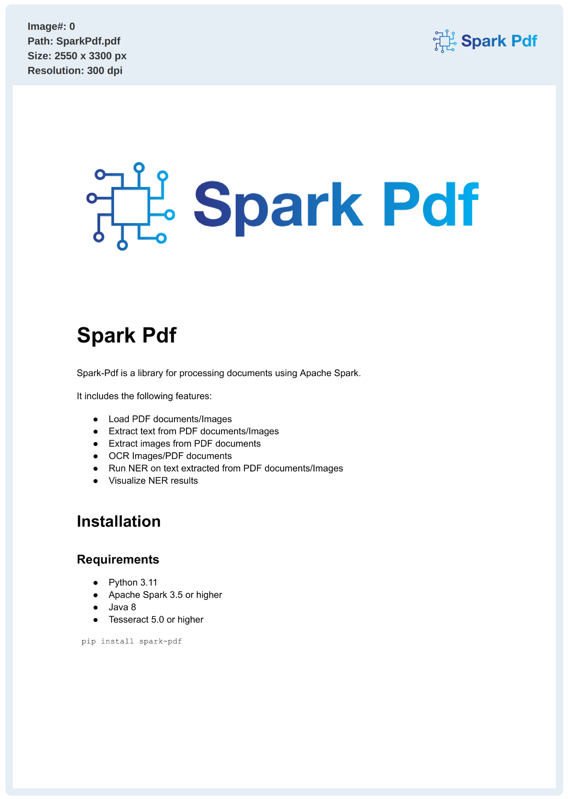
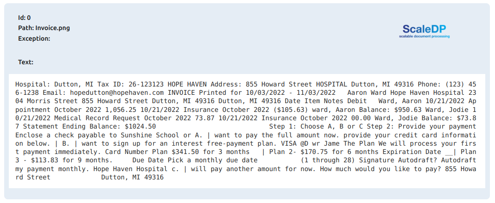

<p align="center">
  <br/>
    
  <br/>
</p>

<p align="center">
    <i>Open-source extension of Apache Spark for Document Processing.</i>
</p>

<p align="center">
    <a href="https://pypi.org/project/pyspark-pdf/" alt="Package on PyPI"></a>
    <a href="https://github.com/stabrise/spark-pdf/blob/main/LICENSE"></a>
    <a href="https://stabrise.com"></a>
</p>

---

**Tutorials**: <a href="https://github.com/StabRise/spark-pdf-tutorials/" target="_blank">https://github.com/StabRise/spark-pdf-tutorials</a>

**Source Code**: <a href="https://github.com/StabRise/spark-pdf/" target="_blank">https://github.com/StabRise/spark-pdf</a>

---

# Welcome to the Spark Pdf library

Spark-Pdf is library allows you to process documents using Apache Spark.  Discover pre-trained models for your projects or play with the thousands of machine learning apps hosted on the [Hugging Face Hub](https://huggingface.co/).

## Key features:

- Load PDF documents/Images to the Spark DataFrame
- Extract text from PDF documents/Images
- Extract images from PDF documents
- OCR Images/PDF documents using various OCR engines
- Run NLP models from the Hugging Face Hub on text extracted from PDF documents/Images
- Visualize results

Support various open-source OCR engines:

 - [Tesseract OCR](https://github.com/tesseract-ocr/tesseract) 
 - [Easy OCR](https://github.com/JaidedAI/EasyOCR)   
 - [Surya OCR](https://github.com/VikParuchuri/surya) 
 - [DocTR](https://github.com/mindee/doctr) 

## Installation

### Prerequisites

- Python 3.10
- Apache Spark 3.5 or higher
- Java 8
- Tesseract 4.0 or higher

### Installation using pip

Install the `Spark-Pdf` package with [pip](https://pypi.org/project/pyspark-pdf/):

```bash
pip install pyspark-pdf
```

### Installation using Docker

Build image:

```bash
  docker build -t spark-pdf .
```

Run container:
```bash
  docker run -p 8888:8888 spark-pdf:latest
```

Open Jupyter Notebook in your browser:
```bash
  http://localhost:8888
```

## Qiuckstart

Start a Spark session with Spark-Pdf:

```python
from sparkpdf import *
spark = SparkPdfSession()
spark
```

Read example pdf file:

```python
pdf_example = files('resources/pdfs/SparkPdf.pdf')

df = spark.read.format("binaryFile") \
    .load(pdf_example)

df.show_pdf()
```
Output:



Define pipeline for extract text from the PDF and call it:

```python
pipeline = PipelineModel(stages=[
    PdfDataToImage(),
    TesseractOcr(keepFormatting=True, psm=PSM.SPARSE_TEXT)
])

result = pipeline.transform(df).cache()
result.show_text()
```

Output:



## Ocr engines

|                   | Bbox  level | Support GPU | Separate model  for text detection | Processing time 1 page (CPU/GPU) secs | Support Handwritten Text |
|-------------------|-------------|-------------|------------------------------------|---------------------------------------|--------------------------|
| [Tesseract OCR](https://github.com/tesseract-ocr/tesseract)     | character   | no          | no                                 | 0.2/no                                | not good                 |
| Tesseract OCR CLI | character   | no          | no                                 | 0.2/no                                | not good                 |
| [Easy OCR](https://github.com/JaidedAI/EasyOCR)          | word        | yes         | yes                                |                                       |                          |
| [Surya OCR](https://github.com/VikParuchuri/surya)         | line        | yes         | yes                                |                                       |                          |
| [DocTR](https://github.com/mindee/doctr)       | word        | yes         | yes                                |                                       |                          |


